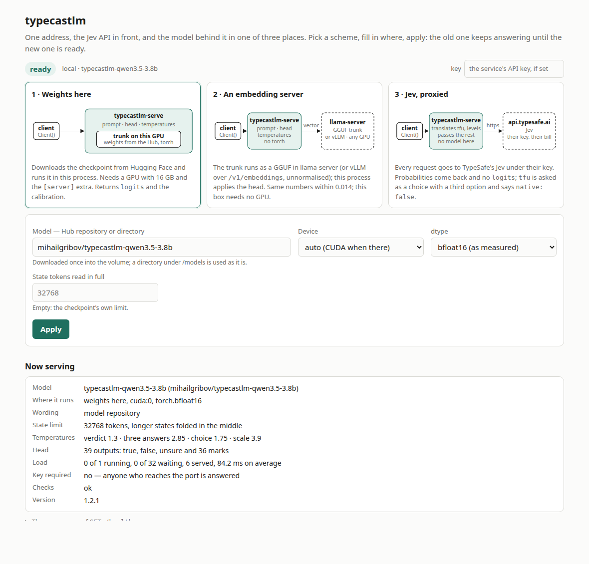
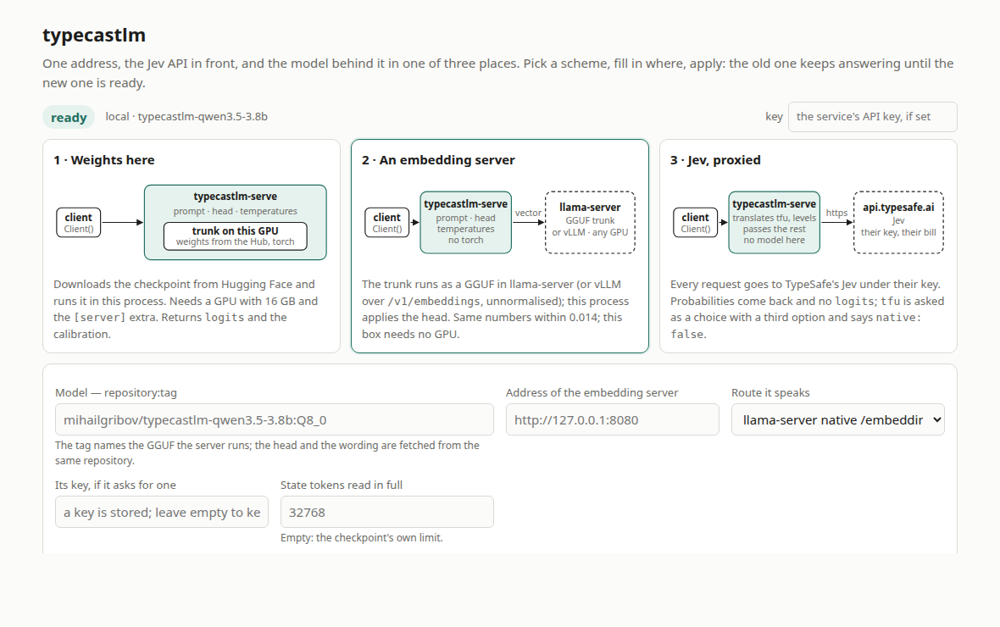
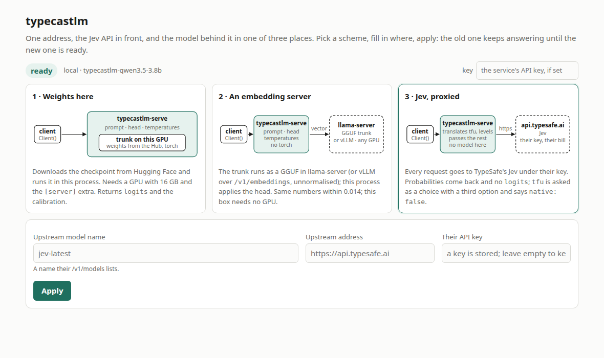
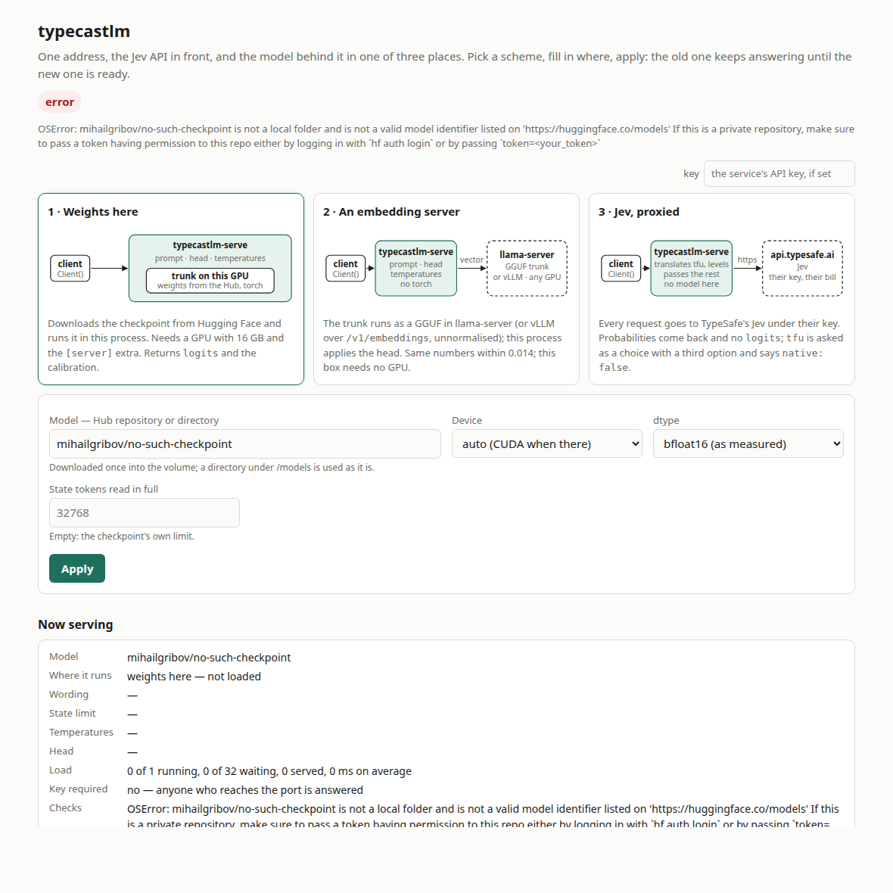
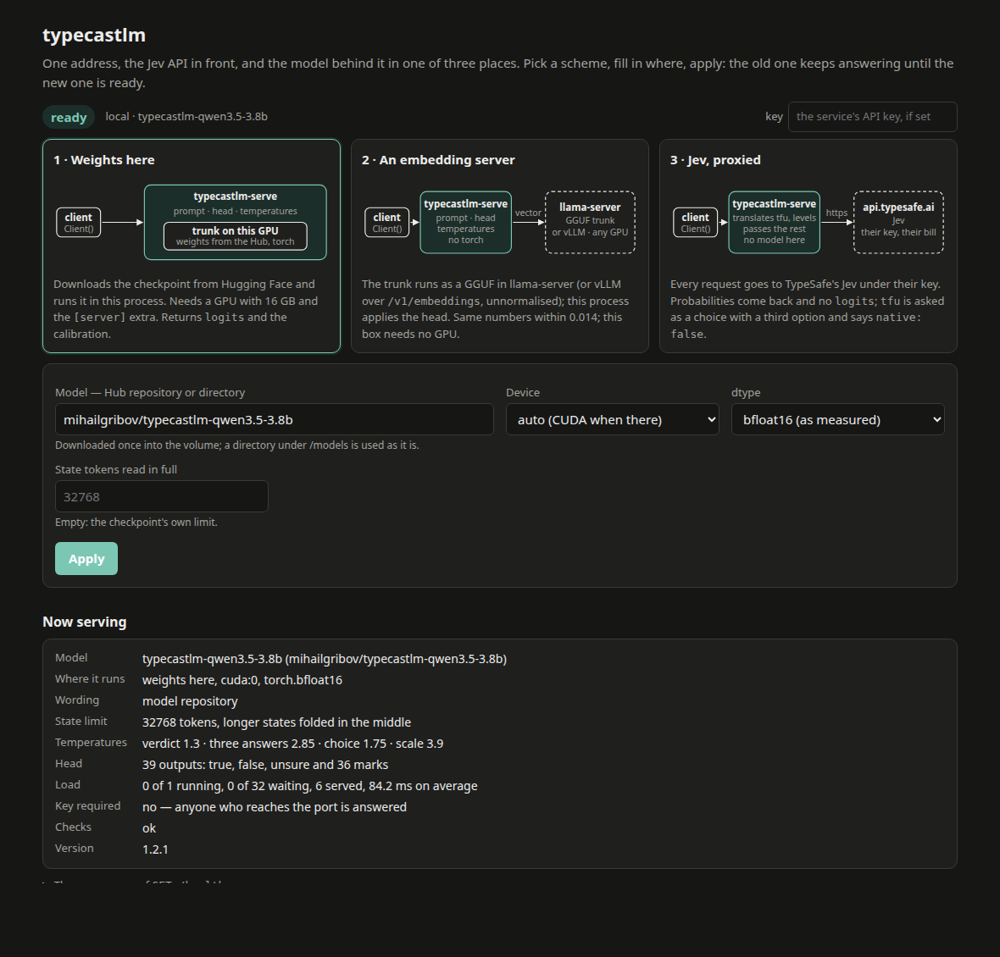

# The page at `/admin`

The service has one page. It shows where the model can be, says where it is now, and moves it:
no restart, no file to edit. Open `http://<host>:<port>/admin` on a running service or container.



## What is on it

**The status line.** `ready`, `loading` while a switch is under way, or `error` when no model is
loaded, with the reason beside it. To the right, a field for the service's API key: the page
itself opens without one, reading and changing the settings needs it when the service was started
with a key. The key is kept in the browser and sent in the `Authorization` header.

**Three cards, one per scheme.** Each draws who talks to whom and says in two lines what the
scheme needs and what comes back. The highlighted card is the one the form below is set to;
clicking a card selects it. A scheme can also be named in the address — `/admin#local`,
`/admin#llama`, `/admin#jev` — to open the page on it.

| card | the model is | the form asks for |
|---|---|---|
| 1 · Weights here | in this process, on this machine's GPU or processor | the repository or directory, the device, the dtype, the state limit |
| 2 · An embedding server | a GGUF in llama-server, or any server returning the vector raw | `repository:tag`, the server's address, the route it speaks, its key if it has one |
| 3 · Jev, proxied | not here at all: requests go to TypeSafe's Jev | the upstream model name, address and their API key |

**The form.** Only the fields the chosen scheme uses are shown. A key field left empty keeps the
key already stored; the page never shows a stored key, only that there is one.





**Now serving.** What is answering at this moment: the model and where it runs, where the wording
came from, the state limit, the temperatures of the four modes, the size of the head, the load —
how many requests are on the model, how many wait, how many were served and how long one takes —
whether a key is required, and the version. It refreshes every five seconds. The raw answer of
`GET /health`, from which all of it is read, is folded below.

## What Apply does

The new backend is loaded beside the old one, which goes on answering; when the new one is
ready the two are swapped between requests, and the settings are written to the config file
(`--config`; in the container, a file in the volume). Minutes for weights that have to be
downloaded, ten seconds for weights already in the cache, a second for the other two schemes.
Moving away from weights held here frees the card: 7.3 GB down to 0.2 GB on the way to the Jev
proxy.

A switch that fails changes nothing. The working backend stays, and the status line says what
went wrong — a server that does not answer, a model that does not exist, a card without room.

## A service with no model

A service that could not load its model still starts and still serves this page: that is how a
container is brought up first and pointed at a model afterwards. The status is `error` with the
reason, the `/v1` routes answer 503, and Apply with working settings puts it right.



## Light and dark

The page follows the system's colour scheme.



## Behind the page

Two routes, both under the service's key, both in [openapi.json](openapi.json):

| route | |
|---|---|
| `GET /admin/config` | the status and the settings, without the stored key |
| `POST /admin/config` | the settings to change; answers at once with `loading`, and `GET` says how it went |

```
curl -X POST localhost:8000/admin/config -H 'Authorization: Bearer …' -H 'content-type: application/json' \
    -d '{"backend": "llama", "backend_endpoint": "http://llama:8080", "model": "mihailgribov/typecastlm-qwen3.5-3.8b:Q8_0"}'
```

The page is one HTML file inside the package, with no build step and nothing loaded from
elsewhere, so it works on a machine with no way out to the internet.
